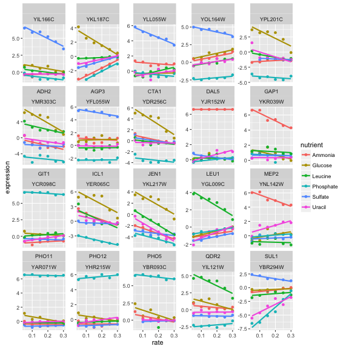
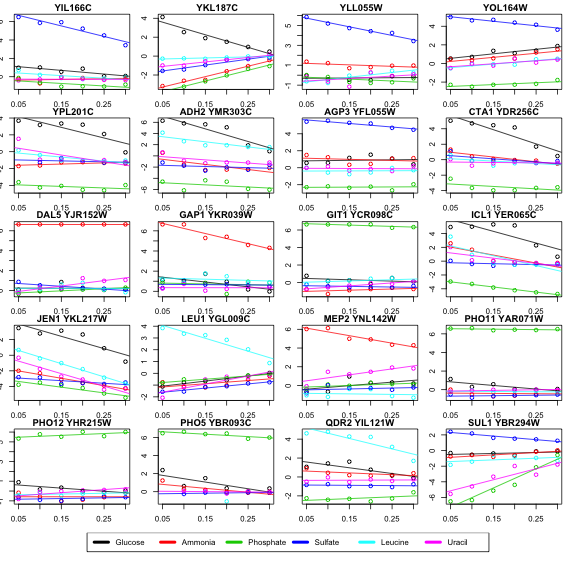
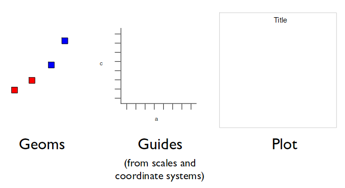
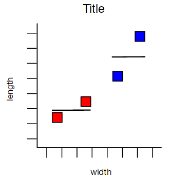

```{r setup, include = FALSE, message = FALSE}
knitr::opts_chunk$set(echo = TRUE, cache = TRUE)
```

# Pull from the course Github

This is an intermediate R course adopted from a [Harvard tutorial](http://tutorials.iq.harvard.edu/R/Rgraphics/Rgraphics.html)

* Assumes working knowledge of R
* Relatively fast-paced
* Focus is on `ggplot2` graphics--other packages will not be covered

# Starting at the end

Goal: reproduce this figure from the Economist:


# What is `ggplot2`?

Popular alternative to "base" R graphics, especially for publication-quality plots.

## Advantages of ggplot2

* consistent underlying 'grammar of graphics' (Wilkinson 2005)
* plot specification at a high level of abstraction
* very flexible
* theme system for polishing plot appearance
* mature and complete graphics system
* many users, active mailing list

### Example: way less code for complex plot

From http://varianceexplained.org/r/why-I-use-ggplot2/

```{r eval=FALSE}
ggplot(top_data, aes(rate, expression, color = nutrient)) +
    geom_point() +
    geom_smooth(method = "lm", se = FALSE) +
    facet_wrap(~name + systematic_name, scales = "free_y")
```



Now create the same using base graphics:

```{r eval=FALSE}
par(mar = c(1.5, 1.5, 1.5, 1.5))

colors <- 1:6
names(colors) <- unique(top_data$nutrient)

# legend approach from http://stackoverflow.com/a/10391001/712603
m <- matrix(c(1:20, 21, 21, 21, 21), nrow = 6, ncol = 4, byrow = TRUE)
layout(mat = m, heights = c(.18, .18, .18, .18, .18, .1))

top_data$combined <- paste(top_data$name, top_data$systematic_name)
for (gene in unique(top_data$combined)) {
    sub_data <- filter(top_data, combined == gene)
    plot(expression ~ rate, sub_data, col = colors[sub_data$nutrient], main = gene)
    for (n in unique(sub_data$nutrient)) {
        m <- lm(expression ~ rate, filter(sub_data, nutrient == n))
        if (!is.na(m$coefficients[2])) {
            abline(m, col = colors[n])
        }
    }
}

# create a new plot for legend
plot(1, type = "n", axes = FALSE, xlab = "", ylab = "")
legend("top", names(colors), col = colors, horiz = TRUE, lwd = 4)
```




## Other plotting packages can be better in certain cases:

* quick exploratory plots can be simpler with base graphics

```{r}
plot(rnorm(100),rnorm(100))
```

* 3-d plots (`rgl` package, Week 8)
* Interactive graphics (see `ggvis` and `gganimate` packages, or Shiny for GUI, Weeks 8 and 9)
* Graph-theory type graphs (nodes/edges layout, see `igraph` package)

# What Is this *Grammar Of Graphics*?

Basic idea: independently specify plot building blocks and combine them to create just about any kind of graphical display you want. Building blocks of a graph include:

* data
* aesthetic mapping
* geometric object
* statistical transformations
* scales
* coordinate system
* position adjustments
* faceting




# Example Data: `Housing prices`

Data from https://www.lincolninst.edu/subcenters/land-values/land-prices-by-state.asp

```{r}
housing <- read.csv("landdata-states.csv")
head(housing[1:5])
```

```{r}
housing$Year <- as.numeric(substr(housing$Date, 1, 4))
housing$Qrtr <- as.numeric(substr(housing$Date, 5, 5))
housing$Date <- housing$Year + housing$Qrtr/4
```

## Compared to base graphics, `ggplot2`:

* is more verbose for simple / canned graphics
* is less verbose for complex / custom graphics
* does not have methods (data should always be in a `data.frame`)
* uses a different system for adding plot elements

### Base graphics histogram example:

```{r}
hist(housing$Home.Value)
```

### `ggplot2` histogram example:

```{r}
library(ggplot2)
ggplot(housing, aes(x = Home.Value)) +
  geom_histogram()
```

Base wins for simple plot!

### Base colored scatter plot example:

```{r}
plot(Home.Value ~ Date,
     data=subset(housing, State == "MA"))
points(Home.Value ~ Date, col="red",
       data=subset(housing, State == "TX"))
legend(1975, 400000,
       c("MA", "TX"), title="State",
       col=c("black", "red"),
       pch=c(1, 1))
```

### `ggplot2` colored scatter plot example:

```{r}
ggplot(subset(housing, State %in% c("MA", "TX")),
       aes(x=Date,
           y=Home.Value,
           color=State))+
  geom_point()
```

ggplot2 wins for more complex plot!

# Geometric Objects And Aesthetics

## Aesthetic Mapping

In ggplot land **aesthetic** means *something you can see*. Examples include:

* position (i.e., on the x and y axes)
* color ("outside" color)
* fill ("inside" color)
* shape (of points)
* linetype
* size

Each type of geom accepts only a subset of all aesthetics–refer to the geom help pages to see what mappings each geom accepts. Aesthetic mappings are set with the `aes()` function.

## Geometic Objects (`geom`)

Geometric objects are the actual marks we put on a plot. Examples include:

* points (`geom_point`, for scatter plots, dot plots, etc)
* lines (`geom_line`, for time series, trend lines, etc)
* boxplot (`geom_boxplot`, for ...duh, boxplots)

A plot must have at least one geom; there is no upper limit. You can add a geom to a plot using the `+` operator

You can get a list of available geometric objects using the code below:
```{r}
help.search("geom_", package = "ggplot2")
```

Or simply type `geom_<tab>` in RStudio to see a list of functions starting with `geom_`

## Points (Scatterplot)

Now that we know about geometric objects and aesthetic mapping, we can make a ggplot. `geom_point` requires mappings for x and y, the `aes()`. All others are optional.

```{r}
hp2001Q1 <- subset(housing, Date == 2001.25) 
ggplot(hp2001Q1,
       aes(y = Structure.Cost, x = Land.Value)) +
  geom_point()
```

Same thing but log transform the Land Values:

```{r}
ggplot(hp2001Q1,
       aes(y = Structure.Cost, x = log(Land.Value))) +
  geom_point()
```

## Lines (Prediction Line)

A plot constructed with `ggplot` can have more than one geom. In that case the mappings established in the `ggplot()` call are plot defaults that can be added to or overridden. Our plot could use a regression line:

```{r}
hp2001Q1$pred.SC <- predict(lm(Structure.Cost ~ log(Land.Value), data = hp2001Q1))

p1 <- ggplot(hp2001Q1, aes(x = log(Land.Value), y = Structure.Cost))

p1 + geom_point(aes(color = Home.Value)) +
  geom_line(aes(y = pred.SC))
```

## Smoothers

Not all geometric objects are simple shapes---`geom_smooth` includes a line and a ribbon.  Hooray for confidence intervals!

```{r}
p1 +
  geom_point(aes(color = Home.Value)) +
  geom_smooth()
```

## Text (Label Points)

Each `geom` accepts a particualar set of mappings. For example, `geom_text()` accepts a `labels` mapping.

```{r}
p1 + 
  geom_text(aes(label=State), size = 3)
```

```{r}
## install.packages("ggrepel") 
library("ggrepel")
p1 + 
  geom_point() + 
  geom_text_repel(aes(label=State), size = 3)
```

## Aesthetic Mapping VS Assignment

Note that *variables* are mapped to aesthetics with the `aes()` function, while *fixed* aesthetics (i.e. want to apply to ALL points) are set outside the `aes()` call. This sometimes leads to confusion, as in this example:

```{r}
p1 +
  geom_point(aes(size = 2))# incorrect! 2 is not a variable
```

```{r}
p1 +
  geom_point(size = 5, color="red") # correct, not in aes()
```

## Mapping Variables To Other Aesthetics

Other aesthetics are mapped in the same way as x and y in the previous example.

```{r}
p1 +
  geom_point(aes(color=Home.Value, shape = region))
```

# Now you try!

Example data consist of *Human Development Index* and *Corruption Perception Index* scores for several countries. The data is in the `EconomistData.csv` file. Read it in with:

```{r}
dat <- read.csv("EconomistData.csv") # Have to be in correct working directory
head(dat)
```

Try to make the following plots. I hid the code - no cheating! If you want to see it, look in the `.Rmd` file.

1.  Create a scatter plot with CPI on the x axis and HDI on the y axis.
2.  Color the points in the previous plot blue.
3.  Color the points in the previous plot according to *Region*.
4.  Create boxplots of CPI by Region
5.  Overlay points on top of the box plots and save to file

## Scatter plot with CPI on the x axis and HDI on the y axis

```{r echo=FALSE}
p <- ggplot(dat, aes(x=CPI, y=HDI))
p + geom_point() + theme_bw()
```

## Color the points blue

```{r echo=FALSE}
p + geom_point(col="blue")
```

## Color according to region

```{r echo=FALSE}
p + geom_point(aes(col=Region))
```

## Boxplots of CPI by region

```{r echo=FALSE}
ggplot(dat, aes(x=Region,y=CPI)) + geom_boxplot()
```

## Overlay points on top of boxplots and save to file

```{r echo=FALSE}
# png(file = "CPI_boxplot.png", width=7, height=7, units="in", res=300)
pdf(file = "CPI_boxplot.pdf", width=7, height=7,useDingbats = FALSE)
ggplot(dat, aes(x=Region, y=CPI)) + geom_boxplot(fill="skyblue") + geom_jitter(width=0.2) + theme_bw()
dev.off()
```

```{r echo=FALSE}
ggplot(dat, aes(x=Region, y=CPI)) + geom_boxplot(fill="skyblue") + geom_jitter(width=0.2) + theme_bw()
dev.copy2pdf(file="CPI_boxplot2.pdf",out.type="pdf")
```


# Resources

* Basis for this lesson 1: [Harvard tutorial](http://tutorials.iq.harvard.edu/R/Rgraphics/Rgraphics.html)
* Basis for this lesson 2: [Hadley slides](http://ggplot2.org/resources/2007-vanderbilt.pdf)
* [Hadley book PDF](http://roger.ucsd.edu/record=b6914994~S9)
* [Hadley slides on ggplot2 motivation and examples](http://ggplot2.org/resources/2007-past-present-future.pdf)
* [Doesn't like ggplot so much](http://simplystatistics.org/2016/02/11/why-i-dont-use-ggplot2/)
* [Response to above, pro-ggplot](http://varianceexplained.org/r/why-I-use-ggplot2/)
* [Reasons to use ggplot system](https://mandymejia.wordpress.com/2013/11/13/10-reasons-to-switch-to-ggplot-7/)


