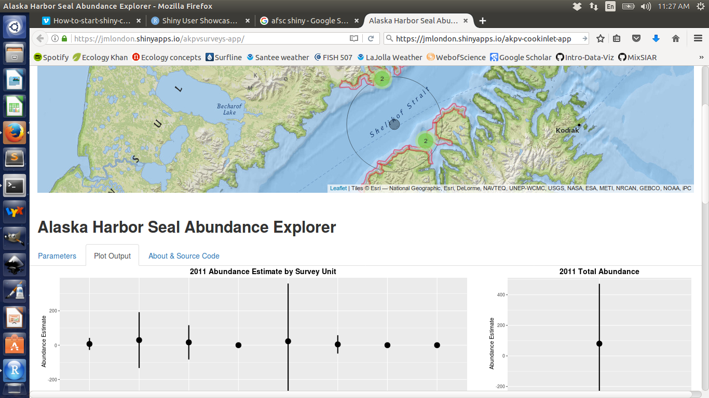
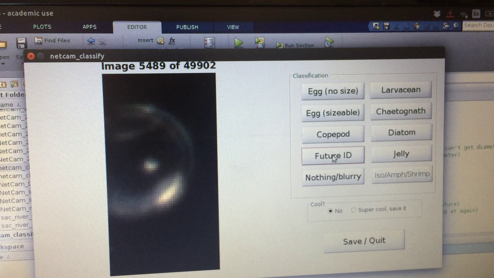

```{r setup, include = FALSE, message = FALSE}
knitr::opts_chunk$set(echo = TRUE, cache = TRUE)
```

# Pull from the course Github

`git pull origin master`

# First, a not-so-shiny story

I came to SIO in Dec 2012 with the task of writing a Graphical User Interface (GUI) to run stable isotope mixing models. I ended up using an R package called `gwidgetsRGtk2`, which did the job:

```{r, echo=TRUE, eval=FALSE}
library(MixSIAR)
mixsiar_gui()
```


## Why didn't I use Shiny?

* It was new and not well documented in 2013. This has HUGELY changed!
* Didn't appreciate the momentum behind R Studio
* The "server" talk made me think it *had* to be hosted online (not true, can be [deployed locally](https://shiny.rstudio.com/articles/deployment-local.html))
* Seemed designed for lightweight computing, not long model runs

I am still not sure if it would have been more or less straightforward to use `Shiny` instead of `gWidgetsRGtk2`... but if I were starting from scratch I would use Shiny. Mostly based on the user community and documentation/examples available now.

# 1. "Get inspired." What is a "Shiny app"?

[Movie explorer](https://shiny.rstudio.com/gallery/movie-explorer.html)

[Health outcomes movie](https://shiny.rstudio.com/gallery/google-charts.html)

## It's got "widgets"

[Widget gallery](https://shiny.rstudio.com/gallery/widget-gallery.html)

## When would I use a Shiny GUI/app?

* Expand reach of your research by reducing barriers to others using your
    * methods (ex: MixSIAR)
    * data (ex: [AFSC Seal surveys](https://jmlondon.shinyapps.io/akpvsurveys-app/))



* Teaching courses (ex: [regression](https://gallery.shinyapps.io/slr_diag/))

* Data exploration

* Data analysis (ex: classify plankton)



# 2. "Get started" (tutorial)

Because I have never used Shiny, let's let R Studio explain the basics:

https://vimeo.com/rstudioinc/review/131218530/212d8a5a7a/#t=4m08s

## Lesson 1

https://shiny.rstudio.com/tutorial/lesson1/

```{r, eval=FALSE}
library(shiny)
runApp("/home/brian/Documents/SIO_misc/SIO-R-Users/Intro-Data-Viz-Winter-2017/week-9/01_hello")
```

## Lesson 2

https://shiny.rstudio.com/tutorial/lesson2/

## Lesson 3

https://shiny.rstudio.com/tutorial/lesson3/

## Lesson 4

https://shiny.rstudio.com/tutorial/lesson4/

## Lesson 5

https://shiny.rstudio.com/tutorial/lesson5/

# Resources

* [Shiny webpage](https://shiny.rstudio.com/)
* [Shiny user showcase](https://www.rstudio.com/products/shiny/shiny-user-showcase/)

