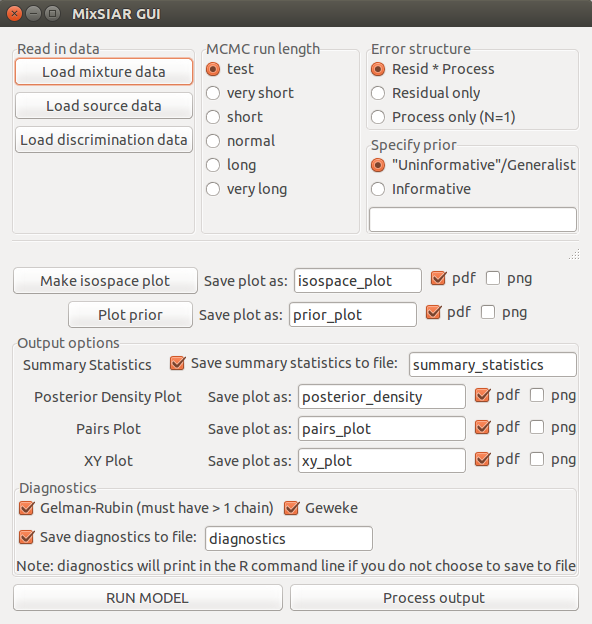

```{r setup, include = FALSE, message = FALSE}
knitr::opts_chunk$set(echo = TRUE, cache = TRUE)
```

# Pull from the course Github

`git pull origin master`

# First, a not-so-shiny story

I came to SIO in Dec 2012 with the task of writing a Graphical User Interface (GUI) to run stable isotope mixing models. I ended up using an R package called `gwidgetsRGtk2`, which did the job:

```{r, echo=TRUE, eval=FALSE}
library(MixSIAR)
mixsiar_gui()
```



## What might you want a GUI to do?

1. Do something when a user clicks a button
2. Let user choose a file
3. Load user's file
4. Let user select options (radio buttons, check boxes)
5. Run analyses
6. Make plots
7. Save files

## Why not Shiny?

* It was new and not well documented
* Didn't appreciate the momentum behind R Studio
* The "server" talk made me think it had to be hosted online (missed the possibility of [local deployment](https://shiny.rstudio.com/articles/deployment-local.html))
* Seemed designed for lightweight computing, not long model runs

**I am still not sure if it would have been more or less straightforward to use Shiny instead of gWidgetsRGtk2.**

# Get inspired.

[Movie explorer](https://shiny.rstudio.com/gallery/movie-explorer.html)
[Health outcomes movie](https://shiny.rstudio.com/gallery/google-charts.html)

[Widget gallery](https://shiny.rstudio.com/gallery/widget-gallery.html)
[Dynamic GUI](https://shiny.rstudio.com/gallery/dynamic-ui.html)

# Resources

* [Shiny webpage](https://shiny.rstudio.com/)


